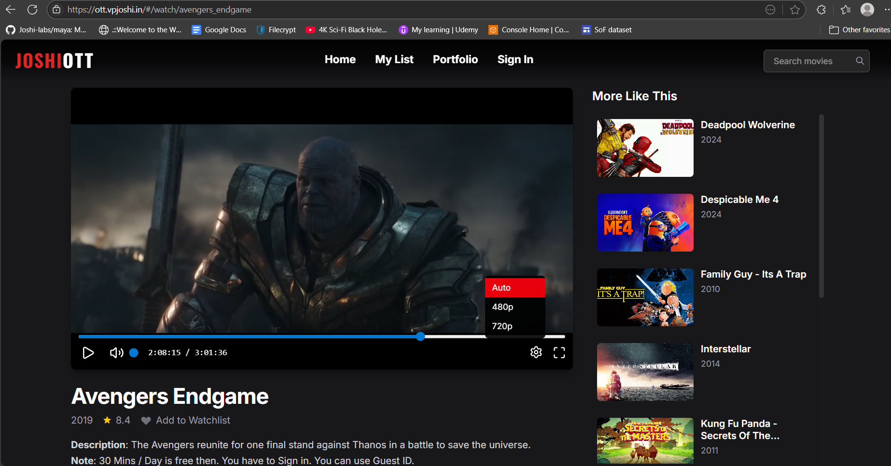

# JoshiOTT

**A sleek, Netflix-style streaming platform** built with Vite, React, Tailwind CSS, Node.js (HLS), and AWS-powered authentication. Fully containerized and deployed—crafted for seamless adaptive-bitrate streaming at **[ott.vpjoshi.in](https://ott.vpjoshi.in)**.

---

## Overview

JoshiOTT is a full-stack, Netflix-style streaming application showcasing:

- **Vite + React + Tailwind CSS** frontend delivering a sleek and responsive UI.
- **Node.js backend** serving HLS video streams with adaptive-bitrate logic for smooth playback.
- **Decoupled, serverless authentication** via AWS Lambda and DynamoDB.
- **Docker-Compose** deployment on an EC2 instance for containerized scalability and stability.

The result: a production-ready OTT platform—fast, secure, and visually polished.

---

## Demo & Screenshots





---

## Built With

- **Frontend**: Vite • React • Tailwind CSS  
- **Backend**: Node.js HLS server with adaptive-bitrate streaming logic  
- **Auth & DB**: AWS Lambda • DynamoDB  
- **Deployment**: Docker Compose on AWS EC2  
- **Streaming Protocol**: HTTP Live Streaming (HLS)

---

## Features

- Modern, responsive UI with Tailwind CSS  
- Adaptive-bitrate HLS streaming for optimal performance  
- Serverless authentication via AWS Lambda  
- DynamoDB for scalable user/session management  
- Full Dockerization for consistent deployments  
- Live deployment at [ott.vpjoshi.in](https://ott.vpjoshi.in)  

---

## Architecture

```
[User Browser]
       ↓
[React Frontend (Vite + Tailwind)] ↔ [AWS Lambda Auth] ↔ [DynamoDB]
       ↓
[Node.js HLS Server] — serves adaptive HLS streams
       ↓
[EC2 Instance with Docker Compose] — hosts frontend + backend containers
```

---

## Prerequisites

- Node.js (v16+) & npm/yarn  
- Docker & Docker Compose  
- AWS credentials configured for Lambda and DynamoDB access  
- Access to the EC2 instance (SSH + Docker support)

---

## Installation & Deployment

```bash
# 1. Clone the repository
git clone https://github.com/Joshi-labs/joshiott_latest.git
cd joshiott_latest

# 2. Install frontend & backend dependencies
cd public
npm install
cd ../src
npm install

# 3. Build frontend
cd public
npm run build

# 4. Prepare environment
# - Ensure AWS credentials are configured
# - Update .env files for Lambda endpoint, DynamoDB table names, HLS server config

# 5. Launch via Docker Compose
cd <root_of_repo>
docker-compose up --build -d

# 6. Access the site
Open http://<your-ec2-public-IP> or https://ott.vpjoshi.in
```

---

## Usage

- **Sign up / Login** — handled by AWS Lambda, sessions stored in DynamoDB.  
- **Browse titles** — React UI displays streaming options with thumbnails.  
- **Play video** — Node.js HLS backend streams adaptive bitrate video.  
- **Adaptive logic** — player adjusts quality based on network in real time.

---

## Streaming & HLS Logic

JoshiOTT implements adaptive-bitrate streaming via HLS:

- Backend packages multiple renditions of a video (e.g., 240p, 480p, 720p).  
- A master playlist allows the client to select the optimal stream.  
- Frontend monitors playback performance and switches quality dynamically.

---

## Live Demo

**[https://ott.vpjoshi.in](https://ott.vpjoshi.in)**

---

## License

MIT License.

---

## Contact

**VP Joshi** — Creator  
Email: vishwashmax@gmail.com  
